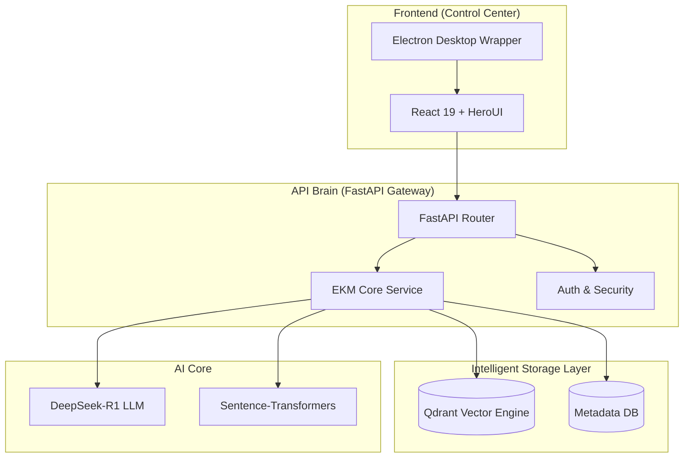

# Credithos: The Enterprise-Grade Episodic Knowledge Mesh


**Credithos** is a state-of-the-art decision intelligence platform that transforms traditional credit underwriting into a sophisticated, autonomous process. By leveraging an **Episodic Knowledge Mesh (EKM)**, Credithos "remembers" every financial decision, grounding AI reasoning in historical precedent to ensure accuracy, explainability, and regulatory compliance.

---

## 🎯 Project Overview & Objectives

In the high-stakes world of credit decisioning, traditional Rule Engines are often too rigid, while pure LLM approaches lack the "memory" of past organizational decisions. **Credithos** bridges this gap by:

1.  **Providing Grounded Reasoning:** Every decision is synthesized by **DeepSeek-R1**, backed by retrieval from a high-dimensional vector database of historical cases.
2.  **Autonomous Knowledge Consolidation:** Inspired by biological sleep, the system periodically clusters and merges redundant knowledge units to maintain an efficient, non-redundant memory mesh.
3.  **Flexible Data Ingestion:** A dynamic mapping protocol allows instant integration of custom CSV data sources without manual code changes.
4.  **Explainable AI (XAI):** Decisions aren't just "Approved" or "Rejected"; they come with deep-thought reasoning paths and links to similar historical precedents.

---

## 🏗️ Architecture & Hierarchy

The system follows a modern decoupled architecture:



### Project Structure
- `src/ekm`: Core logic for the Episodic Knowledge Mesh.
- `src/api`: FastAPI endpoints and routing.
- `ui/`: React application and Electron configuration.
- `scripts/`: Verification and utility scripts.

---

## 💡 Qdrant Integration: The Episodic Memory

Qdrant (State-of-the-art Vector Engine) is the backbone of the Credithos memory system. Unlike standard RAG, we implement **"Mesh Grounding"**:

1.  **Vectorization:** Each `Application` and `Decision` is converted into a 768-dimensional vector using `all-MiniLM-L6-v2`.
2.  **Topological Injection:** We don't just store the embedding; we inject structural signatures (relationships between applicants) into the payload.
3.  **Tensor-Aware Retrieval:** Our `EKMRetriever` uses a custom attention mechanism that performs tensor contractions between the query and candidates stored in Qdrant, ensuring that "similar" means both semantically and contextually relevant.
4.  **Dynamic Upsert:** The system supports real-time memory updates, allowing the model to learn from "Human-in-the-Loop" (HITL) corrections instantly.

---

## 🛠️ Technologies Used

### Backend
- **Python 3.11**
- **FastAPI**: Performance-first API gateway.
- **Qdrant-client**: Interface with the vector memory.
- **DeepSeek-R1**: Advanced reasoning LLM.
- **NetworkX**: Topological mesh analysis.
- **Scikit-learn**: Clustering and normalization.

### Frontend
- **React 19**: Modern UI framework.
- **HeroUI**: Premium component library.
- **Electron 40.0.0**: Native desktop integration.
- **Vite**: Ultra-fast build tool.

---

## ⚡ Setup & Installation

Ensure you have **Python 3.11+** and **Node.js 18+** installed.

### 1. Backend Setup
```bash
# Clone the repository
git clone https://github.com/your-repo/credit_decisioning_ekm.git
cd credit_decisioning_ekm

# Create and activate virtual environment
python -m venv venv311
.\venv311\Scripts\activate  # Windows
source venv311/bin/activate  # Unix

# Install dependencies
pip install -e .
pip install passlib python-multipart python-jose[cryptography] scikit-learn matplotlib faiss-cpu
```

### 2. Configuration
Create a `.env` file from the example:
```bash
cp .env.example .env
```
Add your credentials:
- `QDRANT_URL` & `QDRANT_API_KEY`
- `DEEPSEEK_API_KEY`

### 3. Frontend Setup
```bash
cd ui
npm install
```

---

## 🚀 Usage Examples

### Starting the System
Run the API and Frontend concurrently:
```bash
# Terminal 1: API
python run_api.py

# Terminal 2: UI (Web)
cd ui
npm run dev

# Terminal 3: UI (Electron Desktop App)
cd ui
npm run dev:electron
```

### Workflow
1.  **Login:** Use the default admin credentials.
2.  **Ingest:** Upload a `training_data.csv` to populate the Episodic Memory.
3.  **Evaluate:** Input borrower details in the "Risk Evaluation Wizard" to get AI-powered credit decisions.

---

## 📜 Submission Notes
- **Branch:** All code is committed to the `main` branch.
- **Verification:** Multiple `verify_*.py` scripts are available in the `scripts/` directory for judging verification.
- **Dependencies:** Refer to [pyproject.toml](./pyproject.toml) and [ui/package.json](./ui/package.json).

---

Architected with ❤️ by **Achref Riahi** and **Eya Marzougui**
