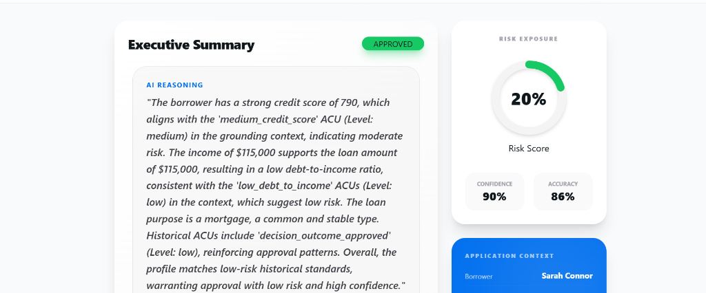

# Credithos


**The Enterprise-Grade Episodic Knowledge Mesh for Credit Intelligence**

> *Credithos goes beyond traditional Rule Engines. It uses an Agentic Memory Mesh to "remember" every financial decision, grounding AI reasoning in historical precedent.*

---

## 🚀 Key Innovations

*   **Episodic Knowledge Mesh (EKM):** Persistent memory of `Borrowers`, `Applications`, and `Decisions` stored as high-dimensional vectors.
*   **Grounded Reasoning:** Uses **DeepSeek-R1** to analyze risk factors against a vector database (Qdrant) of similar cases, ensuring explainable results.
*   **Dynamic CSV Mapping:** A sophisticated ingestion protocol that allows users to map custom CSV headers to the system's internal schema on-the-fly.
*   **Sleep Consolidation:** Biological-inspired algorithm to cluster and merge redundant knowledge units, keeping the mesh efficient.

---

## 📊 Visual Workspace

### Risk Evaluation Wizard
The wizard guides underwriters through complex decisions, providing real-time AI reasoning grounded in historical precedents.


*Sarah Connor gets approved based on strong precedents.*

### Dynamic Data Mapping
Easily ingest data with varying schemas. Our UI detects headers and allows manual alignment before ingestion.


*Aligning FICO scores and other custom headers.*

---

## 🛠️ Technical Stack

### Backend (The Brain)
*   **FastAPI:** High-performance async gateway.
*   **Qdrant:** State-of-the-art vector engine for episodic memory.
*   **DeepSeek-R1:** Advanced reasoning LLM for grounded decision synthesis.
*   **NetworkX:** Used for topological analysis of the knowledge mesh.

### Frontend (The Control Center)
*   **React 19 + HeroUI:** Premium, state-of-the-art interface design.
*   **Electron:** Native desktop wrapper for workstation use cases.
*   **Vite:** Sub-second build and hot-reloading.

---

## 📜 Technical Documentation

For a deep dive into the mathematics of the Knowledge Mesh and our Qdrant implementation, refer to:
👉 **[Credithos Technical Whitepaper](./credithos_technical_report.tex)** (LaTeX Source)

For details on the system optimizations and performance improvements:
👉 **[Optimization Report](./OPTIMIZATION_REPORT.md)**

---

## ⚡ Quick Start

### 1. Backend Setup
```bash
# Create and activate virtual environment
python -m venv venv311
.\venv311\Scripts\activate

# Install dependencies
pip install -e .
pip install passlib python-multipart python-jose[cryptography] scikit-learn matplotlib faiss-cpu

# Configure Environment
cp .env.example .env
# Edit .env and add your DEEPSEEK_API_KEY and QDRANT details
```

### 2. Frontend Setup
```bash
cd ui
npm install
```

### 3. Run the System
```bash
# Terminal 1: Start the API Brain
python run_api.py

# Terminal 2: Launch the Electron Dashboard
cd ui && npm run dev
```

---

## 🤝 Contributing
Contributions are welcome! Please see [CONTRIBUTING.md](./CONTRIBUTING.md) for guidelines.

## ⚖️ License
This project is licensed for **Educational Use Only**. See [LICENSE](./LICENSE) for full details.

---

Architected with ❤️ by **Achref Riahi** and **Eya Marzougui**
